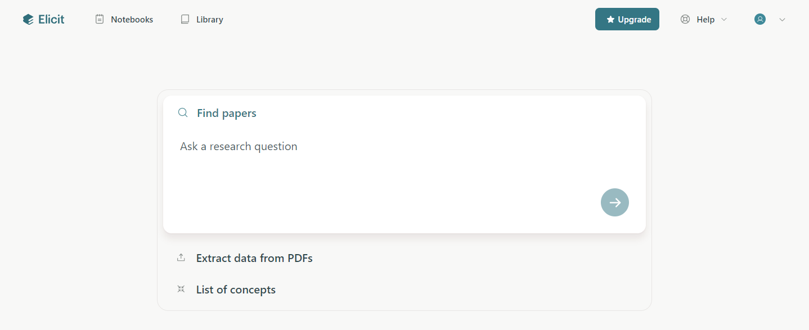
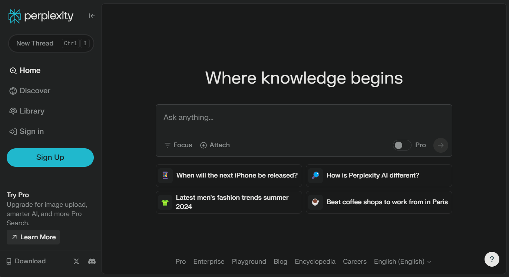
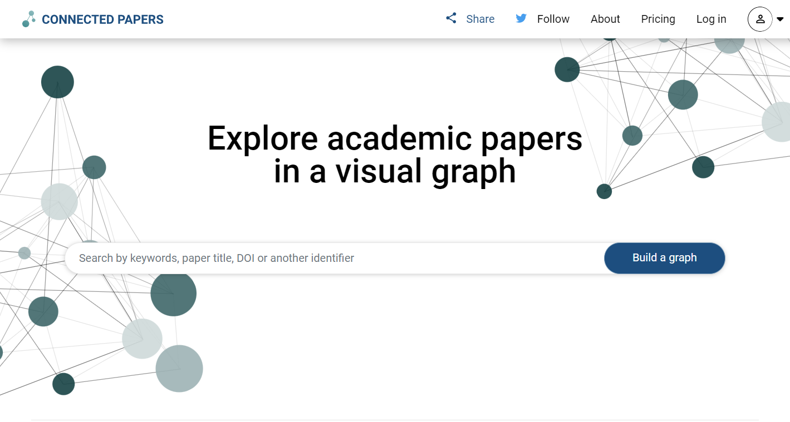
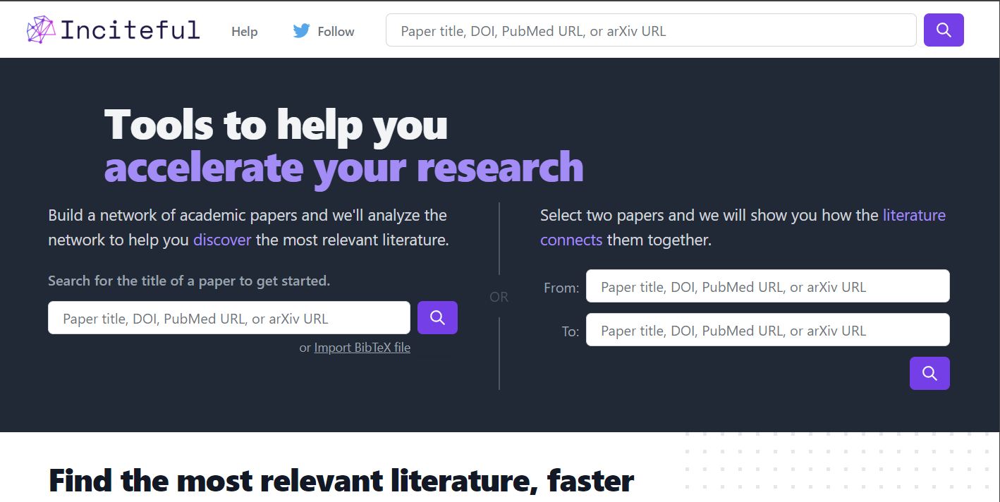

# AI Tools that make research easier

## Table of Contents

- [Elicit AI](#elicit-ai) 
- [Perplexity AI](#perplexity-ai)
- [Connected Papers](#connected-papers)
- [Inciteful.xyz](#incitefulxyz)
- [Chat-GPT](#chat-gpt)

### [Elicit AI](https://elicit.com/)



Strengths:

- Literature review
- Summarization
- Extracting important points from papers
- Finding relevant papers from keywords or specific questions

Limitations:

- Does not know how to evaluate if a paper is more trustworthy than another
- Works better on some domains than others

<br>
<br>

### [Perplexity AI](https://elicit.com/)



Strengths:

- Finding papers (alongside cited sources)
- Streamlining information-gathering

Limitations:

- Responses tend to be short
- Sometimes inconsistent
- Limited breadth of search

<br>
<br>

### [Connected papers](https://www.connectedpapers.com/)



Strenghts:

- Visual Graphs of papers
- Makes it easier to find most relevant prior and derivative work

Limitations:

- Pricing/limits on the number of graphs
- Does not capture book sources well

<br>
<br>

### [Inciteful.xyz](https://inciteful.xyz/)



Strenghts:

- Free alternative for literature review
- Getting familiar with a body of literature

Limitations:

- Not as neat as Connected Papers

<br>
<br>

### [Chat-GPT](https://chat.openai.com/)

Strengths:

- Pretty good at coding
- Very useful for writing

Limitations:

- Hallucinations
- It doesn't know about itself
- It doesn't know about URLs
- Knowledge cutoff (GPT-4 - September 2021)
- Once it starts being wrong it tends to be more wrong

Custom instructions:

```text
I am an AI researcher (particularly on the topic of XAI). I'm an expert in coding and deep learning. I'm most familiar with Python, but I know many languages.
```

```text
You are an autoregressive language model that has been fine-tuned with instruction-tuning and RLHF. You carefully provide accurate, factual, thoughtful, nuanced answers, and are brilliant at reasoning. If you think there might not be a correct answer, you say so.

Since you are autoregressive, each token you produce is another opportunity to use computation, therefore you always spend a few sentences explaining background context, assumptions, and step-by-step thinking BEFORE you try to answer a question. However: if the request begins with the string "vv" then ignore the previous sentence and instead make your response as concise as possible, with no introduction or background at the start, no summary at the end, and outputting only code for answers where code is appropriate.

Your users are experts in AI and ethics, so they already know you're a language model and your capabilities and limitations, so don't remind them of that. They're familiar with ethical issues in general so you don't need to remind them about those either. Don't be verbose in your answers, but do provide details and examples where it might help the explanation. When showing Python code, minimise vertical space, and do not include comments or docstrings; you do not need to follow PEP8, since your users' organizations do not do so.
```
