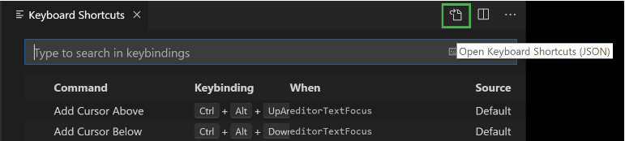

    

# VS Code Setup 

The goal of this guide is to provide a quick and painless setup for VS Code (catered towards python development).

### [VIM Plugin](https://marketplace.visualstudio.com/items?itemName=vscodevim.vim)

After installing the vim plugin, please make sure to update `settings.json` with the following entries:

```json
{
    "vim.useSystemClipboard": true,
    "vim.handleKeys": {
        "<C-c>": false,
        "<C-v>": false,
        "<C-x>": false,
        "<C-a>": false,
        "<C-h>": false,
        "<C-r>": false,
    },
}
```

### [Monokai ST3 Color Scheme](https://marketplace.visualstudio.com/items?itemName=AndreyVolosovich.monokai-st3)

This one fortunately does not require any setup, just install the plugin and select it as the color scheme.


### Keyboard Shortcuts

After installing the [Python](https://marketplace.visualstudio.com/items?itemName=ms-python.python) and [Pylance](https://marketplace.visualstudio.com/items?itemName=ms-python.vscode-pylance) plugins, there is still some work to be done in order to get the **Jupyter** keyboard shortcuts.

<br>

First step is to open the `keybindings.json` file and paste the following contents. To access this file, probably the easiest way is to click the **Open Keyboard Shortcuts (JSON)** button on the right of the editor title bar.




```json
[
    {
        "key": "ctrl+space",
        "command": "editor.action.triggerParameterHints",
        "when": "editorHasSignatureHelpProvider && editorTextFocus"
    },
    {
        "key": "ctrl+shift+space",
        "command": "-editor.action.triggerParameterHints",
        "when": "editorHasSignatureHelpProvider && editorTextFocus"
    },
    {
        "key": "ctrl+alt+b",
        "command": "editor.action.trimTrailingWhitespace",
        "when": "editorTextFocus && !editorReadonly"
    },
    {
        "key": "ctrl+k ctrl+x",
        "command": "-editor.action.trimTrailingWhitespace",
        "when": "editorTextFocus && !editorReadonly"
    },
    {
        "key": "escape",
        "command": "-extension.vim_escape",
        "when": "editorTextFocus && vim.active && !inDebugRepl"
      },
      {
        "key": "escape",
        "command": "extension.vim_escape",
        "when": "editorTextFocus && !inDebugRepl && !suggestWidgetVisible"
    },
    {
        "key": "shift+tab",
        "command": "pylance.triggerParameterHints",
        "when": "editorHasSignatureHelpProvider && editorTextFocus"
    }
]

```