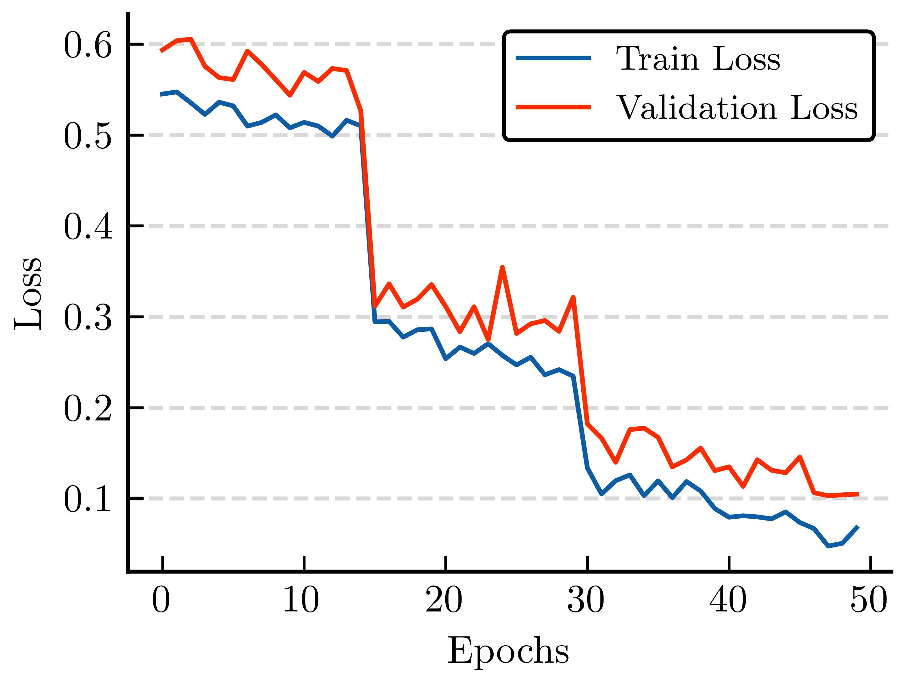

# Making better scientific plots

This guide is inspired by the **[SciencePlots](https://github.com/garrettj403/SciencePlots/)** package which offers *Matplotlib styles for scientific figures*. <br>

This repo contains a set of Matplotlib styles for better formatting of figures for research papers, academic articles, presentations, theses or any formal scientific document. <br>

**Important**. When setting the figure size for a plot, please keep in mind that the aspect ratio should be around `1.333333`. E.g. `(4, 3)`, `(3.5, 2.625)`, `(3.3, 2.5)` - IEEE.

<div align="center">
    
</div>

## Table of contents

1. [Using the Styles](#using-the-styles)
2. [Styles Differences](#styles-differences)
3. [Matplotlib Specifics](#matplotlib-specifics)
   - [Matplotlib defaults](#matplotlib-defaults)
   - [Setting the fonts](#setting-the-fonts)
   - [Anatomy of a figure](#anatomy-of-a-figure)
4. [Tutorials](#tutorials)
5. [Examples](#examples)

## Using the Styles

The main style intended for use is called `"science"`. In order to set is as the style for the plots, this should be added to the python script/notebook:

```python
import matplotlib.pyplot as plt

# When running from a Jupyter notebook, don't forget to add this
%matplotlib inline

# Assuming "science.mlpstyle" is in the current directory
plt.style.use('science.mlpstyle')
```

If the style files are not in the same directory as the source code for plotting, one possible fix would be the following:

```python
# Otherwise here is a quick and dirty example for making it work
# with an arbitrary path
from pathlib import Path
path_styles = Path('../styles')


def styles(paths):
    paths = [paths] if not isinstance(paths, list) else paths
    return [path_styles/f"{path}.mlpstyle" for path in paths]


with plt.style.context(styles(['science'])):
    # The plotting stuff goes here
    pass
```

Also, multiple style can be used together (the order is important as the next styles might override some of the settings set by the previous ones).

```python
plt.style.use(['science.mlpstyle', 'latex.mlpstyle'])
```

For this example, the `latex` style will override the font family and size from the `science` style. <br>

To use a style only temporarily, you can use a context manager:

```python
with plt.style.context(['science.mlpstyle']):
    plt.figure()
    plt.plot(x, y)
    plt.show()
```

## Styles Differences

```yaml
# Minimal is science with the following differences:
xtick.minor.visible:    False
xtick.top:              False

ytick.minor.visible:    False
ytick.right:            False

axes.spines.right:      False
axes.spines.top:        False


# Clasic is science with the following differences:
xtick.minor.visible:    False
xtick.top:              False

ytick.minor.visible:    False
ytick.right:            False
```

## Matplotlib specifics


### Matplotlib defaults

The default matplotlib configuration can be found [here](https://matplotlib.org/stable/users/explain/customizing.html#the-default-matplotlibrc-file).

### Setting the fonts

Most of the fonts are generally set to a certain size via `font.size`, for a more granular approach, please consider the following settings:

```yaml
axes.labelsize:         12
legend.fontsize:        12
legend.title_fontsize:  12
axes.titlesize:         14
xtick.labelsize:        12
ytick.labelsize:        12
```

If you wish to set the general font size directly from code, it can be done as such:

```python
import matplotlib.pyplot as plt
plt.rcParams.update({'font.size': 12})
```

### Anatomy of a figure

Taken from [here](https://matplotlib.org/stable/users/explain/quick_start.html), the following image displays various elements of a matplotlib figure.

<div align="center">
    
</div>

## Tutorials

On the subject of having an example/tutorial on how to plot something nicely, please consider the following resources:

- [Matplotlib Tutorial (2022): For Physicists, Engineers, and Mathematicians](https://www.youtube.com/watch?v=cTJBJH8hacc)
- [Ten simple rules for better figures](https://journals.plos.org/ploscompbiol/article?id=10.1371/journal.pcbi.1003833)
- [Matplotlib tutorial](https://github.com/rougier/matplotlib-tutorial/tree/master)

## Examples

The [Plot_examples.ipynb](examples/Plot_examples.ipynb) notebook contains a few plot examples that make use of the styles provided in this guide/repo. For the source code, or any other implementation details, please check the notebooks in the [examples/](examples/) directory. That being said, here are a few examples of nice scientific visualizations.

Using the `science` stylesheet.


Using the `minimal` configuration.




Example of `clasic` plot.


