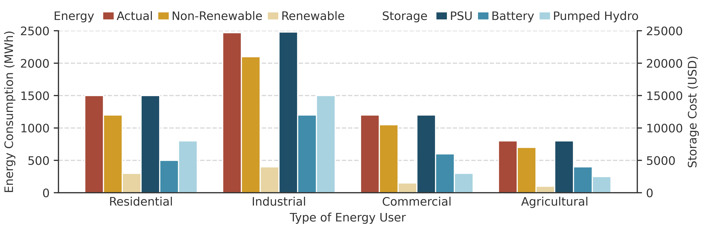
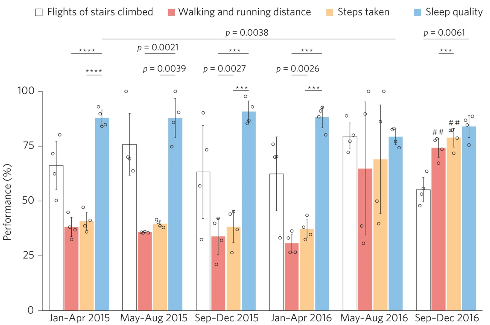
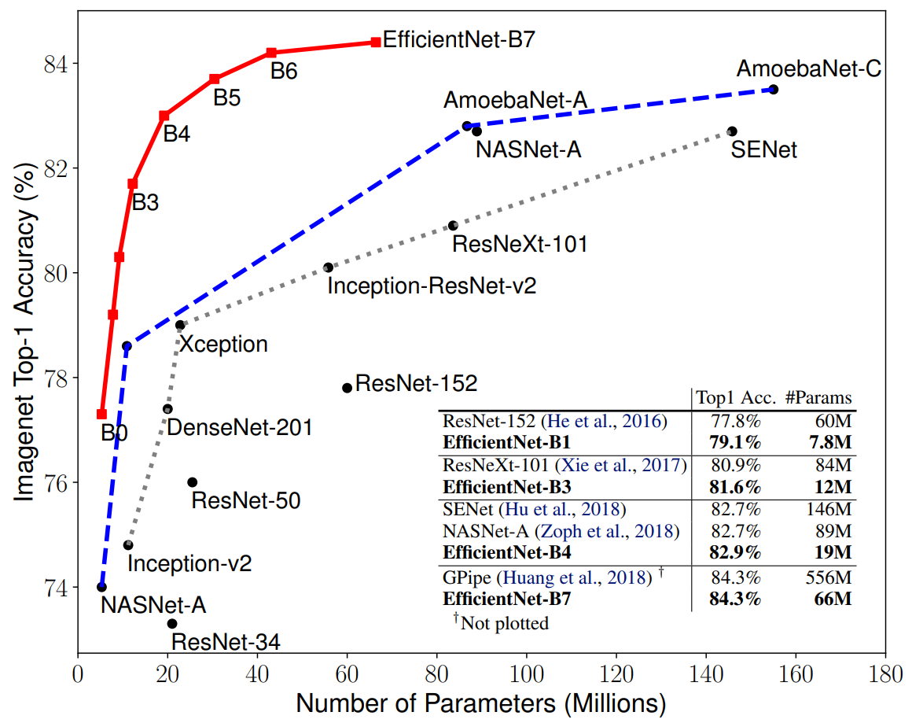

# Examples of good scientific plots

## Using the styles

Using a custom `minimal_grouped_barchart` style (based on the `minimal` style). The code for producing this plot can be found in [GroupedBarchart.ipynb](./GroupedBarchart.ipynb).

## Found

From [Show the dots in plots](https://www.nature.com/articles/s41551-017-0079) short paper about data representation in bar plots.

The [EfficientNet paper](https://arxiv.org/abs/1905.11946) has a nice linepot on the evolution of Model Size vs. ImageNet Accuracy. 

