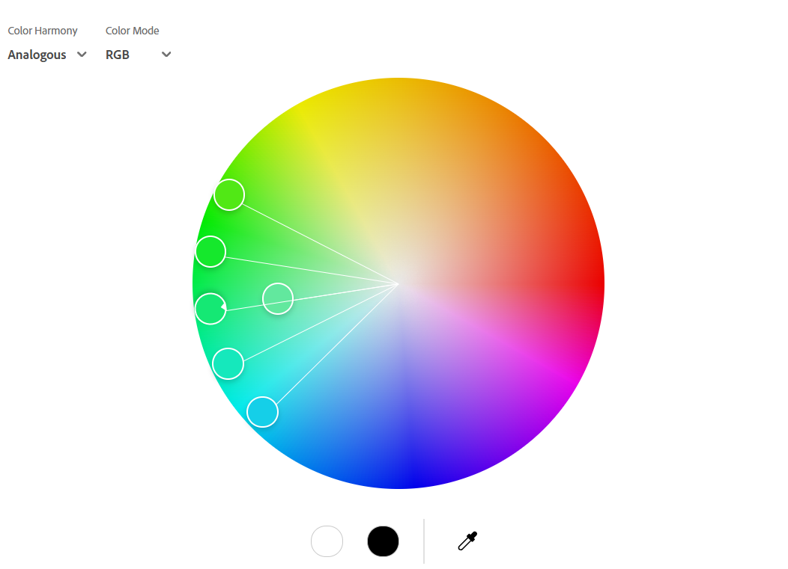
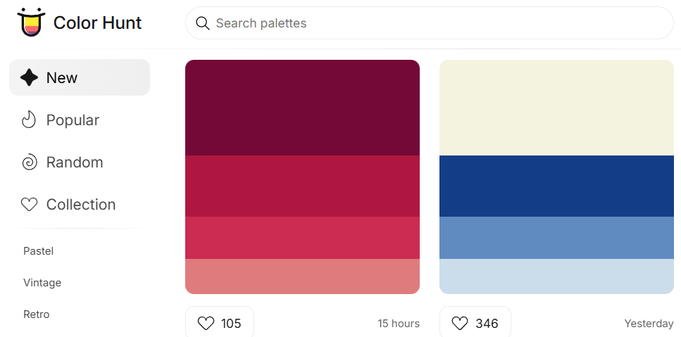

# Resources for making better plots

1. [Selecting colors](#selecting-colors)
2. [Tutorials](#tutorials)

## Selecting colors

Here are some useful resources for selecting colors:

| Resource        | Link                                                          | Screenshot         |
|------------------|---------------------------------------------------------------|---------------------|
| Adobe Color      | [Adobe Color](https://color.adobe.com/create/color-wheel)    |  |
| Color Hunt       | [Color Hunt](https://colorhunt.co/)                          |    |

## Tutorials

On the subject of having an example/tutorial on how to plot something nicely, please consider the following resources:

- [Matplotlib Tutorial (2022): For Physicists, Engineers, and Mathematicians](https://www.youtube.com/watch?v=cTJBJH8hacc)
- [Ten simple rules for better figures](https://journals.plos.org/ploscompbiol/article?id=10.1371/journal.pcbi.1003833)
- [Matplotlib tutorial](https://github.com/rougier/matplotlib-tutorial/tree/master)