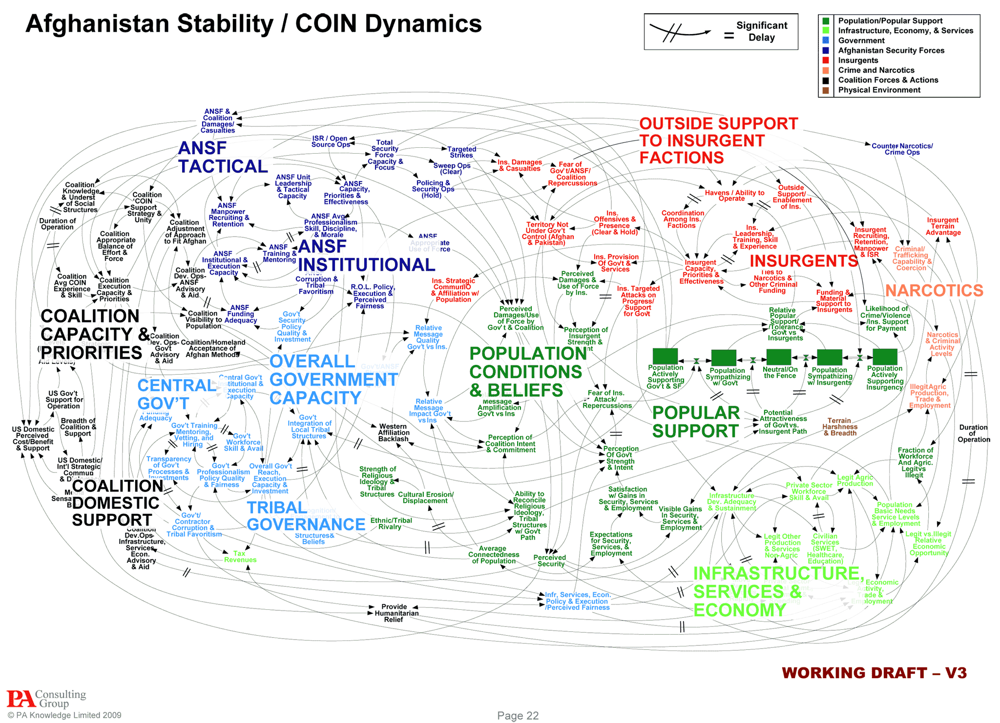

# [How to Speak](https://www.youtube.com/watch?v=Unzc731iCUY&t=37s)

The success in life will be determined largely by:

- your ability to **speak**.
- your ability to **write**.
- the quality of your **ideas**.

> ! IN THAT ORDER.

 

## How to Start

- ~~Joke~~
  - at the beginning the audience is not accustomed to you speaking parameters and they tend to land flat
- Define the RULES of ENGAGEMENT
  - E.g. no laptops
- PROMISE (of empowerment)
  - E.g. By the end of the 60 mins you'll have been exposed to ideas, some of which you will incorporate into your own repertoire.

 

## 4 Sample Heuristics

### Cycle

Circle around the subject about 3 times.

### Building a Fence (around you idea)

Make it so that your idea can be distinguished from other ideas.  
E.g. My approach might seem similar to that algorithm only that it runs in linear time instead of exponential.

### Verbal Punctuation

Use verbal cues to let the audience know when they can hop back in.  
Also, can you guess what is another idea to get someone back on the bus?

### Ask a Question

You should wait around 7 seconds after asking the question (though it may seem as an eternity). The question should not be too easy, so that they feel dumb for answering it but also not too complex because nobody will know the answer.

 

## The Tools

### Time & Place

- Around 11 AM would be ideal.
- The room should be well lit - *it is extremely hard to see slides through closed eyelids*.
- Case the joint.
- The room should be reasonably populated - more than half full.

### The Board

- Has a graphic quality
- The speed at which you write is about the speed of processing the information
- Serves as a target - to have something to do/ point at with your hands (as you may become acutely aware of them)

### Props

- Can have a remarkable impact if used correctly.

> Both the board and the props serve as empathetic mirrors.

### Slides

- Very good for exposing ideas.
- NOT as good for teaching ideas.
- They should be condiments to what you are saying (not the main event or the other way around).

### Hapax Legomenon

- You can get away it such a thing exactly once.

    

 

## Informing

- Again, that promise.
- Exhibit **passion** about what you are doing.
  - Hard to overstate the importance of this one.
- How to think.
  - Humans are story-telling animals.
  - Provide people the stories they need to know
  - The questions they need to ask about those stories
  - Mechanisms for analyzing those stories
  - Ways of putting the stories together
  - Ways of evaluating how reliable a story is

 

## Persuading

For job talks, you get about 5 minutes to show:

- Vision
- That you've done something

For getting famous, the first question is why and one rather compelling way of putting it is:

> You get used to being famous, but you almost never get used to being ignored.

So, it is a legitimate thing to concern yourself with packaging. How to get remembered then?

    

 

## How to Stop

### Final slide

- Collaborators 
- Questions? (GOD NO) 
- The end (EVEN WORSE) 
- Contributions 

### Final words

- Joke 
- Thank you 
  - You will no go to hell for saying thank you but it is a weak move.
- Salute the audience 
